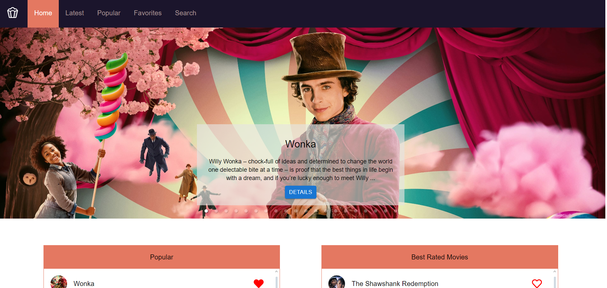
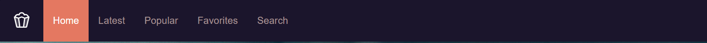
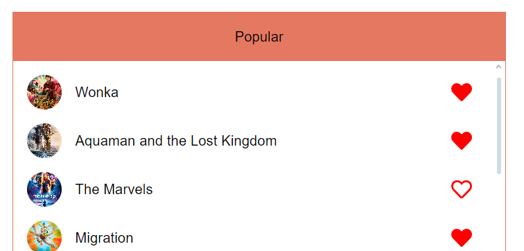
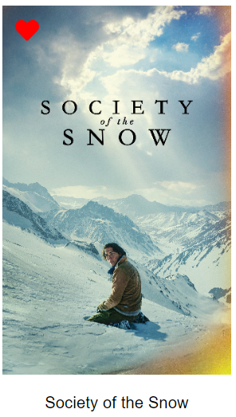
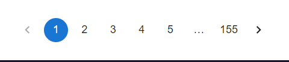
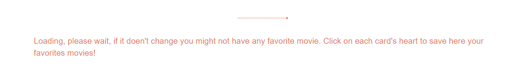
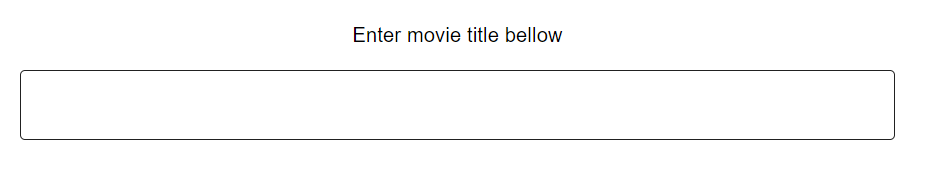
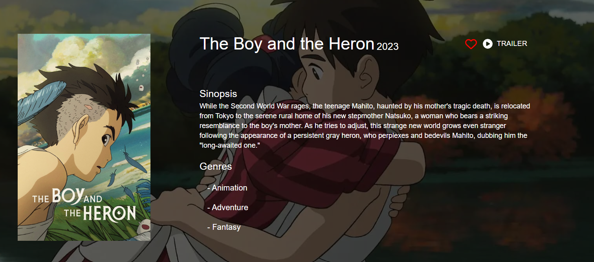
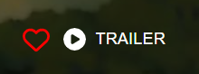

# **MOVIES BROWSER**

## ABOUT

The objective of this project is to go further with React and the posibilitys that it brings to us. We includes context and custom hooks for this project.

 
    

## Skills used

 
    

## WEBSITE STRUCTURE / HOW TO USE IT

### ✦ NavBar

On the top of the document I included a navigation bar so be able to switch between each section.

 
    

### ✦ Home section

Home is just to show a carousel with popular movies with their description and a detail button that takes you to the detail movie page.
Also it has 2 containers with popular and top rated movies lists. Each item of the list is a button that directs you to the detail movie page and also has a heart button to be able to add to your favorites movies

 
    

### ✦ Latest | Popular | Favorites sections

This sections works exactly the same way. You have a title and bellow a list of movie cards. You can click each card to lead you to the movie detail page or a heart button to add/remove to your favorites movies. On the bottom of the document you also have a pagination component to be able to continue browsing on the movie list.

 
    

 
    

For favories works the same but it uses local storage to save the movies instead of calling from api, here you will se only the movies you've hearted before.

If you see this messagge is because you didn't heart any movie.

 
    

### ✦ Search section

At this section you can browse the movies data by writing the name of the movie you look for at the input bellow. The search bar works while you write the name and it updates the search on each letter you enter.

 
   

The rest of the section works exactly the same Favorites, Latest and Popular sections.

### ✦ Movie Details

This page will only shows when you click a detail button or a card movie. It will provide you information (description and genres) of the movie and a Trailer button to be able to see the trailer from a youtube link without leaving the website. Also you can heart and add to favorites from here.

 
   

 
   

## NEW KNOWLEDGE APPLIED

### ✦ React

In this case, as is a project for the FrontEnd career of ADA ITW, I aplied all the past knowledge from the other projects and for the first time I used context and custom hooks for react.

## RESOURCES

-   CSS Framework -> [Material UI](https://mui.com/material-ui/)
-   Data -> [TMDB](https://developer.themoviedb.org/docs/getting-started)

## CONTACT ME

If you are interested in contacting me, as I say it on the project, you can find me on the following links:

-   [LinkedIn](https://www.linkedin.com/in/romina-rao-50a61a1ba/)
-   [raoromina96@gmail.com](mailto:raoromina96@gmail.com)
-   [Instagram](https://instagram.com/renga.art/)
-   [Check my other GitHub repositories](https://github.com/RomiRao?tab=repositories)
